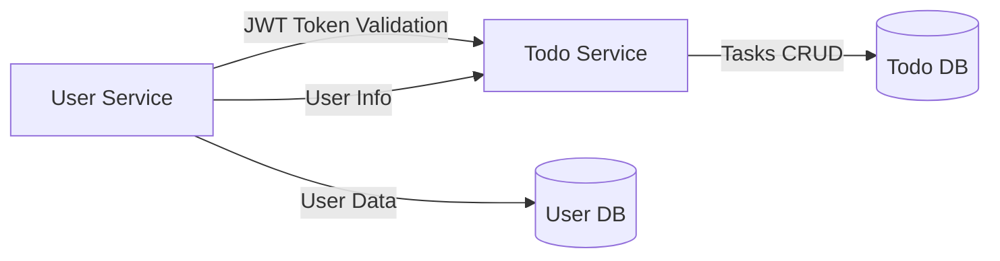

# ToDo App Microservices Project


---

## Project Overview
ToDo App is a microservices-based application consisting of two core services:

1. **User Service** – Handles user registration, authentication, authorization (JWT), and profile management.  
2. **Todo Service** – Manages tasks for authenticated users, including CRUD operations, search, and task prioritization.  

The system uses JWT for authentication, and all requests to Todo Service must be authorized via User Service.

---
## Repository Structure
```
toda-app/
├─ user-service/
│  ├─ src/
│  ├─ pom.xml
│  └─ README.md (User Service detailed docs)
├─ todo-service/
│  ├─ src/
│  ├─ pom.xml
│  └─ README.md (Todo Service detailed docs)
└─ README.md (This file)
```

---

## Technologies Used Across Services

| Technology      | Purpose                                     |
| --------------- | ------------------------------------------- |
| Java 17         | Core backend language                       |
| Spring Boot     | REST API development                        |
| Spring Security | Authentication & Authorization (JWT)       |
| JWT             | Token-based security                        |
| JPA / Hibernate | ORM                                         |
| MySQL           | Relational database                         |
| Swagger         | API documentation                           |
| Lombok          | Reduce boilerplate                          |
| Maven           | Dependency management                       |
| JUnit & Mockito | Unit testing                                |

---

## Services Overview

### 1. User Service
Handles user authentication and management.  

 **Key Features:**
- User registration, login, OTP activation
- JWT token generation and validation
- Profile management
- Secured endpoints

**Run Locally:**
```bash
cd user-service
mvn spring-boot:run
```
[Swagger UI](http://localhost:8083/swagger-ui/index.html) – access API docs  
[Full Documentation](user-service/README.md) – detailed User Service docs


---
### 2. Todo Service
 Handles task management for authenticated users.
 
**Key Features:**
- Create, update, delete tasks
- Search tasks by name and priority
- Pagination for task listing
- Task ownership enforced via JWT

**Run Locally:**
```bash
cd todo-service
mvn spring-boot:run
```

[Swagger UI](http://localhost:8082/swagger-ui/index.html) – access API docs  
[Full Documentation](todo-service/README.md) – detailed Todo Service docs


## Architecture Diagram



- User Service validates tokens and provides user info to Todo Service.

- Todo Service stores tasks in its own database, associated with user IDs.

---
## How to Run the Full Application
- 1. Ensure MySQL is running and databases for both services are created.

- 2. Start User Service first to handle authentication.

- 3. Start Todo Service and configure it to point to the User Service for JWT validation.

- 4. Use Swagger UI or Postman to test APIs.
