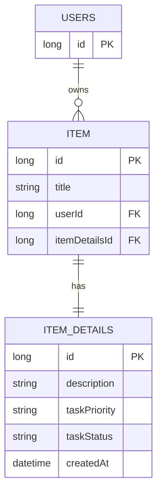

# Todo Service (Task Management Microservice)


[](https://hibernate.org/)
[](https://www.mysql.com/)

---

## Service Overview
Todo Service is a microservice responsible for **task management (CRUD operations)**.  
It manages user tasks and integrates with **User Service** for user authentication and authorization via JWT.  
This service **focuses purely on task-related business logic** and does not handle user authentication directly.

---

## Features

### Task Management
- Create a new task
- Update an existing task
- Delete a task
- Retrieve all tasks or a specific task
- Mark tasks as completed or pending
- Search tasks by name
- Search tasks by priority
- Associate each task with the authenticated user

### Security
- JWT-based authentication
- Validates JWT tokens via User Service
- Only the task owner can update or delete their tasks

---

## JWT & Token Usage
- All endpoints are protected via JWT
- Token must be sent in the request header:

```http
Authorization: Bearer <JWT_TOKEN>
```
---
# Todo Service relies on User Service to:
- Validate the token
- Extract authenticated user ID
- Ensure only the task owner can modify their tasks
---
## Testing

- This service includes unit tests written with JUnit 5 & Mockito.

  ### Covered Areas:

- Task creation, update, and deletion

- Task retrieval by ID, name, and priority

- Authorization checks to ensure task ownership

- Error handling when tasks are not found or users are unauthorized

- Service layer tested in isolation with mocked repositories and UserClientService

---
## Security & Authorization
- JWT token is required for all task endpoints

- Only the authenticated user can modify or delete their tasks

- Token validation is centralized and reusable via User Service 

---
## How Other Microservices Use Todo Service
### Other microservices interact with Todo Service to:

- Create or manage tasks for authenticated users

- Retrieve tasks for a specific user

- Ensure tasks are linked to the correct user without handling authentication themselves

### This ensures:

- Single source of truth for task management

- Cleaner separation of concerns

- No duplicated business logic
---
##  Technologies Used

| Technology      | Purpose                                           |
| --------------- | ------------------------------------------------- |
| Java 17         | Core backend language                             |
| Spring Boot     | REST API development                              |
| Spring Security | Authentication & Authorization (via User Service) |
| JWT             | Token-based security                              |
| JPA / Hibernate | ORM                                               |
| MySQL           | Relational database                               |
| Swagger         | API documentation                                 |
| Lombok          | Reduce boilerplate                                |
| Maven           | Dependency management                             |
| JUnit & Mockito | Unit testing                                      |

---
## API Endpoints
| Method | Endpoint                                      | Description                                                    |
| ------ | --------------------------------------------- | -------------------------------------------------------------- |
| POST   | `/api/v1/task`                                | Create a new task for the authenticated user                   |
| PATCH  | `/api/v1/task/{id}`                           | Update an existing task                                        |
| DELETE | `/api/v1/task/{id}`                           | Delete a task                                                  |
| GET    | `/api/v1/task`                                | Retrieve all tasks of the authenticated user (with pagination) |
| GET    | `/api/v1/task/{id}`                           | Retrieve a specific task by ID                                 |
| GET    | `/api/v1/task/search/name/{name}`             | Search tasks by name                                           |
| GET    | `/api/v1/task/search/priority/{taskPriority}` | Search tasks by priority                                       |

---
## Database Schema


---
##  API Documentation
- [Swagger UI](http://localhost:8082/swagger-ui/index.html) *(Run the Spring Boot server locally to access)*

