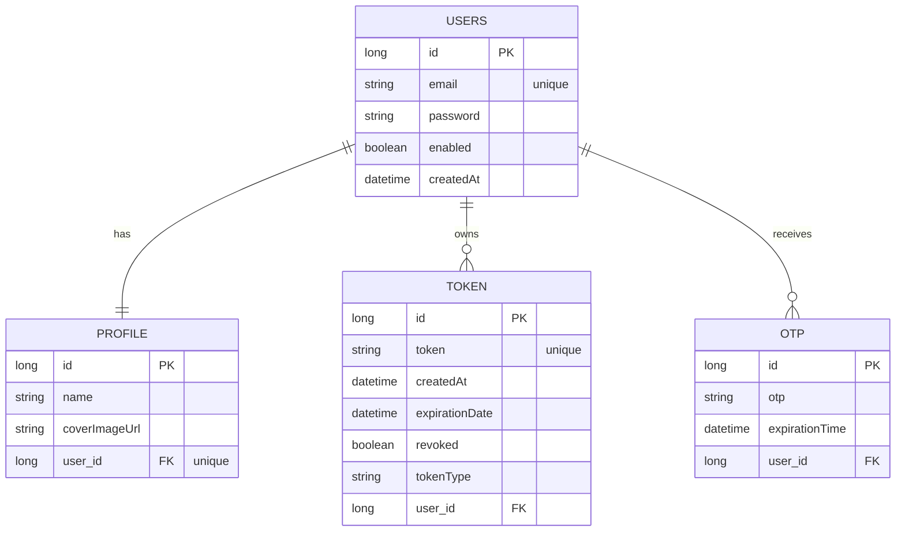

##  User Service (Authentication & User Management Microservice)


[](https://hibernate.org/)
[](https://www.mysql.com/)

---
## Service Overview
User Service is a core microservice responsible for **identity, authentication, and security** within the system.
It provides centralized JWT-based authentication and is consumed by other microservices (Todo Service) to validate tokens and retrieve authenticated user information.
This service strictly focuses on **security concerns** and does NOT handle business logic of other services.

---

##  Features

###  Authentication
- User registration with email verification (OTP)
- User login with JWT generation
- Account activation using OTP
- Regenerate activation OTP
- JWT token validation
- Extract user ID from JWT

###  User Management
- Update user information
- Delete user account
- Create or update user profile
- Profile image support
- Secure all user endpoints

### Security
- JWT-based authentication
- Fully stateless design (no server-side sessions)
- Spring Security integration
- Token revocation support
- Centralized token validation for other microservices

---

## JWT & Token Lifecycle

- JWT is issued upon successful login
- Token metadata is persisted in the database
- Tokens can be revoked manually or automatically
- Expired or revoked tokens are rejected during validation

---

## Testing

This service includes unit tests written with **JUnit 5 & Mockito**.

### Covered Areas
- Authentication logic
- Token generation & validation
- OTP verification rules
- User service business rules

### Testing Strategy
- Service layer is tested in isolation
- External dependencies (repositories, clients) are mocked
- Focus on business logic rather than framework behavior


---
##  Security & Authorization

- JWT token is required for protected endpoints
- Token must be sent in request header:

```http
Authorization: Bearer <JWT_TOKEN>
```
- Token validation is centralized and reusable by other microservices
---

## How Other Microservices Use User Service

Other microservices (Todo Service) interact with User Service to:

1. Validate JWT tokens
2. Extract authenticated user ID
3. Trust user identity without handling authentication themselves

This ensures:
- Single source of truth for authentication
- No duplicated security logic
- Cleaner separation of concerns


---
##  Technologies Used

| Technology | Purpose |
|----------|--------|
| Java 17 | Core backend language |
| Spring Boot | REST API development |
| Spring Security | Authentication & Authorization |
| JWT | Token-based security |
| JPA / Hibernate | ORM |
| MySQL | Relational database |
| Swagger | API documentation |
| Lombok | Reduce boilerplate |
| Maven | Dependency management |
| JUnit & Mockito | Unit testing |

---

##  API Endpoints

###  Authentication APIs

| Method | Endpoint | Description |
|------|--------|------------|
| POST | `/api/v1/auth/register` | Register a new user |
| POST | `/api/v1/auth/login` | Login and generate JWT |
| POST | `/api/v1/auth/activate` | Activate account using OTP |
| POST | `/api/v1/auth/regenerateOtp` | Regenerate activation OTP |
| GET | `/api/v1/auth/checkToken` | Validate JWT and extract user ID |
| POST | `/api/v1/auth/forgetPassword` | Generate OTP for password reset |
| POST | `/api/v1/auth/changePassword` | Change password using OTP |

---

###  User APIs

| Method | Endpoint | Description |
|------|--------|------------|
| PATCH | `/api/v1/users/{id}` | Update user data |
| DELETE | `/api/v1/users/{id}` | Delete user |
| PATCH | `/api/v1/users/profile/{id}` | Create or update user profile |

---

## Database Schema




##  API Documentation
- [Swagger UI](http://localhost:8083/swagger-ui/index.html) *(Run the Spring Boot server locally to access)*

---
